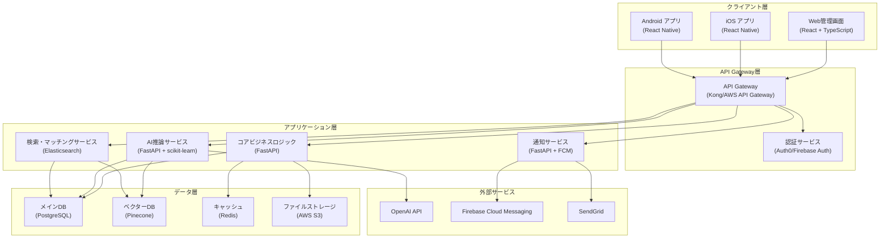
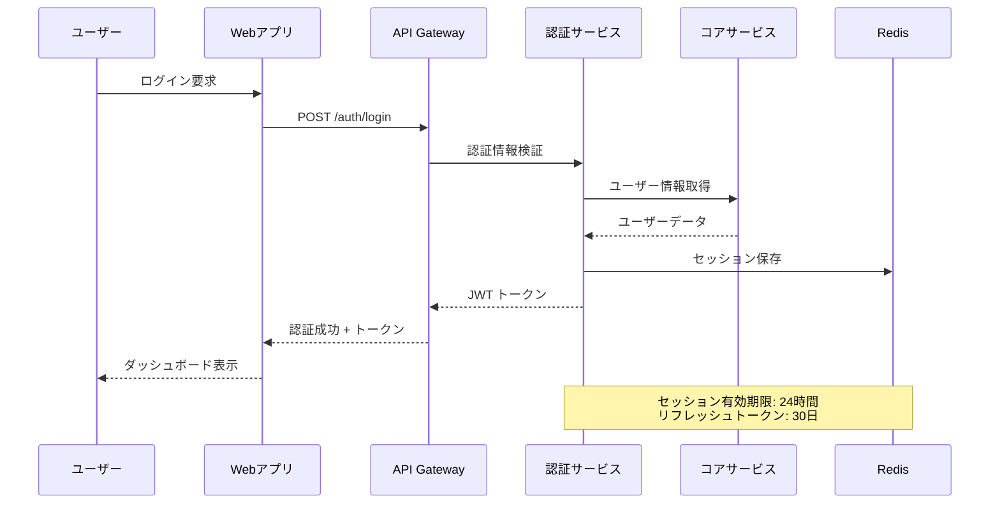
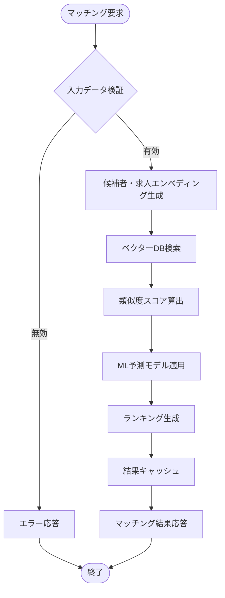
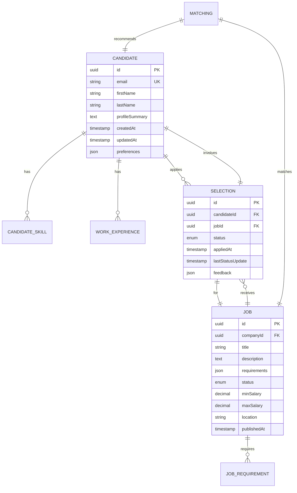
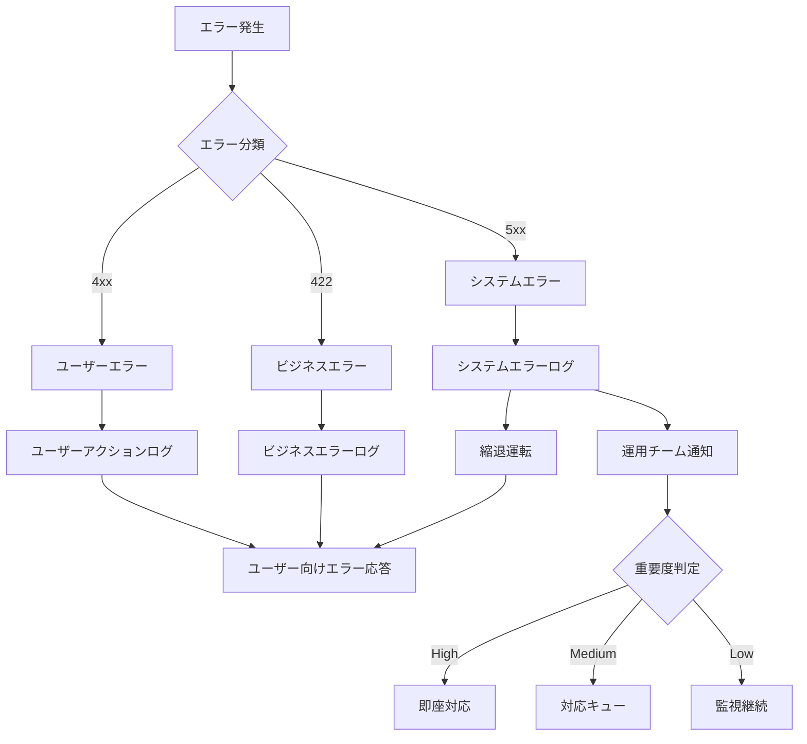

# 技術設計書 - 人材マッチングプラットフォーム

## 概要

**目的**: このシステムは人材紹介会社の社内コンサルタントに高精度なマッチング機能とAI補助機能を提供し、候補者と企業の効率的なマッチングを実現します。

**ユーザー**: 社内コンサルタント（50-200名規模）が日常的な候補者・企業管理とマッチング業務で利用し、候補者がモバイルアプリで求人確認と応募管理を行います。

**影響**: 従来の手動ベースのマッチングプロセスをAI駆動の自動化システムに変革し、マッチング精度80%以上、業務効率30%向上を実現します。

### 目標
- 候補者と求人の高精度自動マッチング（80%以上の適合率）
- リアルタイムな選考進捗管理と情報共有
- AI予測による合格率分析とレコメンデーション
- マルチプラットフォーム対応（Web管理画面、iOS/Androidアプリ）

### 非目標
- 一般公開求人サイト機能
- 外部求人サイトとの双方向連携
- 給与計算・労務管理機能

## アーキテクチャ

### 高レベルアーキテクチャ



### 技術スタックと設計決定

#### フロントエンド
- **Web**: React.js + TypeScript + Ant Design
- **Mobile**: React Native + TypeScript
- **理由**: 開発チームのJavaScript熟練度活用、コンポーネント再利用、型安全性確保

#### バックエンド
- **言語**: Python
- **フレームワーク**: FastAPI
- **API**: RESTful API + GraphQL（複雑クエリ用）
- **認証**: JWT + OAuth 2.0

**選択理由**: AI/ML処理における豊富なライブラリ、FastAPIの高性能非同期処理、自動API文書生成機能

#### データストレージ
- **メインDB**: PostgreSQL
- **ベクターDB**: Pinecone
- **キャッシュ**: Redis
- **ファイルストレージ**: AWS S3

**選択理由**: PostgreSQLの成熟したORM、Pineconeの企業級パフォーマンス（50ms以下のクエリ応答）、Redisのセッション管理

#### AI・機械学習
- **フレームワーク**: scikit-learn、TensorFlow Lite
- **自然言語処理**: HuggingFace Transformers
- **外部API**: OpenAI GPT-4 API

#### インフラ
- **クラウド**: AWS
- **コンテナ**: Docker + Kubernetes
- **CI/CD**: GitHub Actions

### 主要設計決定

#### 決定1: ベクターデータベースとしてPineconeを選択
- **決定**: Pineconeをセマンティック検索とAIマッチング用ベクターデータベースとして採用
- **背景**: 候補者と求人の意味的類似性計算、大規模データ（100万件以上）での高速検索が必要
- **代替案**: Weaviate（オープンソース、マルチモーダル対応）、ChromaDB（軽量、簡易）
- **選択理由**: サブ50msのクエリ応答、マネージドサービスによる運用負荷軽減、SOC2/GDPR準拠
- **トレードオフ**: 得るもの（高性能、運用性）vs 失うもの（コスト、ベンダーロックイン）

#### 決定2: モバイルアプリにReact Nativeを採用
- **決定**: iOS/AndroidアプリをReact Nativeで統一開発
- **背景**: クロスプラットフォーム開発によるリソース効率化、WebチームのJavaScript知識活用
- **代替案**: Flutter（高性能、UI一貫性）、ネイティブ開発（最高性能）
- **選択理由**: 既存Web開発チームの知識活用、JavaScriptエコシステム（180万パッケージ）へのアクセス
- **トレードオフ**: 得るもの（開発効率、チーム活用）vs 失うもの（一部性能、カスタムUI制限）

#### 決定3: マイクロサービス指向のモジュラーアーキテクチャ
- **決定**: コアビジネスロジック、AI推論、通知を独立サービスとして分離
- **背景**: 異なる性能要件、独立したスケーリング、開発チーム分離の必要性
- **代替案**: モノリシック（シンプル）、完全マイクロサービス（高複雑性）
- **選択理由**: AI処理の計算集約性、通知システムの可用性要件、段階的な機能追加への対応
- **トレードオフ**: 得るもの（スケーラビリティ、技術選択柔軟性）vs 失うもの（複雑性、運用オーバーヘッド）

## システムフロー

### ユーザー認証・セッション管理フロー



### AIマッチングスコア算出フロー



## 要件トレーサビリティ

| 要件 | 要件概要 | コンポーネント | インターフェース | フロー |
|------|----------|----------------|------------------|--------|
| 1.1 | 企業・求人管理システム | CompanyService, JobService | CompanyAPI, JobAPI | CRUD操作フロー |
| 1.2 | 候補者管理システム | CandidateService, ResumeParser | CandidateAPI | レジュメ解析フロー |
| 1.3 | 選考・マッチング管理 | MatchingService, SelectionService | MatchingAPI | マッチングフロー |
| 1.4 | AI アシスタント機能 | AIService, PredictionService | AI API | 予測フロー |
| 1.5 | モバイルアプリケーション | MobileAppService | Mobile API | 認証・同期フロー |

## コンポーネントと インターフェース

### ビジネスロジック層

#### CandidateService

**責任と境界**
- **主要責任**: 候補者情報のCRUD操作、スキル・経歴管理、レジュメ解析結果の構造化保存
- **ドメイン境界**: 候補者関連データと操作（企業・求人データとは分離）
- **データ所有権**: 候補者基本情報、職歴、スキル、希望条件、選考履歴
- **トランザクション境界**: 候補者情報更新は単一トランザクション内で完了

**依存関係**
- **インバウンド**: Web管理画面、モバイルアプリ、マッチングサービス
- **アウトバウンド**: PostgreSQL、S3（レジュメファイル）、AIサービス（解析）
- **外部**: OpenAI API（レジュメ解析）、SendGrid（通知メール）

**契約定義**

```typescript
interface CandidateService {
  createCandidate(data: CreateCandidateRequest): Result<Candidate, ValidationError>;
  updateCandidate(id: string, data: UpdateCandidateRequest): Result<Candidate, NotFoundError | ValidationError>;
  searchCandidates(criteria: SearchCriteria): Result<CandidateList, SearchError>;
  parseResume(file: File): Result<ResumeData, ParseError>;
  getCandidateProfile(id: string): Result<CandidateProfile, NotFoundError>;
}

type CreateCandidateRequest = {
  basicInfo: PersonalInfo;
  skills: Skill[];
  experience: WorkExperience[];
  preferences: JobPreferences;
};

type CandidateProfile = {
  id: string;
  basicInfo: PersonalInfo;
  skills: Skill[];
  workHistory: WorkExperience[];
  preferences: JobPreferences;
  selectionHistory: SelectionRecord[];
  matchingScore?: number;
};
```

- **事前条件**: 有効な認証トークン、必須フィールドの存在
- **事後条件**: データベース一貫性保証、監査ログ記録
- **不変条件**: 候補者IDの一意性、個人情報の暗号化保存

#### MatchingService

**責任と境界**
- **主要責任**: 候補者と求人の自動マッチング、スコア算出、推薦リスト生成
- **ドメイン境界**: マッチングロジックとアルゴリズム（候補者・求人の詳細管理は他サービス）
- **データ所有権**: マッチング結果、スコア履歴、推薦設定
- **トランザクション境界**: バッチマッチング処理（非リアルタイム）

**依存関係**
- **インバウンド**: Web管理画面、定期バッチジョブ、通知サービス
- **アウトバウンド**: CandidateService、JobService、AIService、ベクターDB
- **外部**: Pinecone（ベクター検索）、OpenAI API（意味解析）

**契約定義**

```typescript
interface MatchingService {
  calculateMatchingScore(candidateId: string, jobId: string): Result<MatchingScore, CalculationError>;
  findMatchingJobs(candidateId: string, limit: number): Result<JobMatch[], SearchError>;
  findMatchingCandidates(jobId: string, limit: number): Result<CandidateMatch[], SearchError>;
  runBatchMatching(criteria: BatchCriteria): Result<BatchResult, ProcessingError>;
}

type MatchingScore = {
  overall: number; // 0-100
  skillMatch: number;
  experienceMatch: number;
  locationMatch: number;
  salaryCompatibility: number;
  cultureFit: number;
  confidence: number;
};

type JobMatch = {
  job: JobSummary;
  score: MatchingScore;
  reasoning: string[];
  lastUpdated: timestamp;
};
```

#### AIService

**責任と境界**
- **主要責任**: AI推論処理、予測モデル実行、自然言語処理、エンベディング生成
- **ドメイン境界**: AI/ML処理専門（ビジネスロジックは他サービス）
- **データ所有権**: 学習済みモデル、エンベディングベクター、予測結果
- **トランザクション境界**: 推論処理は独立実行（他処理との分離）

**外部依存関係調査**

**OpenAI API統合**:
- **認証方式**: API キーベース認証（企業プランでSSO対応）
- **利用制限**: GPT-4 Turbo: 1分間10,000リクエスト、1日間2,000,000トークン
- **料金体系**: GPT-4 Turbo: $10/1Mトークン（入力）、$30/1Mトークン（出力）
- **レスポンス時間**: 平均2-5秒（コンテキスト長に依存）

**Pinecone統合**:
- **認証**: APIキー + プロジェクトID
- **制限**: Starter: 1インデックス、5M vectors、Standard: $70/月から
- **性能**: 平均クエリ応答時間 < 50ms
- **可用性**: 99.95% SLA（Standard以上）

**契約定義**

```typescript
interface AIService {
  generateEmbedding(text: string): Result<number[], EmbeddingError>;
  predictSuccess(candidateProfile: CandidateProfile, jobRequirements: JobRequirements): Result<SuccessPrediction, PredictionError>;
  analyzeResume(resumeText: string): Result<StructuredResume, AnalysisError>;
  generateRecommendations(userId: string, context: RecommendationContext): Result<Recommendation[], RecommendationError>;
}

type SuccessPrediction = {
  successProbability: number; // 0.0-1.0
  confidenceLevel: number;
  keyFactors: string[];
  riskFactors: string[];
  recommendation: ActionRecommendation;
};
```

### API層

#### RESTful API契約

| Method | Endpoint | Request | Response | Errors |
|--------|----------|---------|----------|--------|
| POST | /candidates | CreateCandidateRequest | Candidate | 400, 409, 422 |
| PUT | /candidates/{id} | UpdateCandidateRequest | Candidate | 400, 404, 422 |
| GET | /candidates/{id}/matches | MatchingCriteria | JobMatch[] | 404, 500 |
| POST | /matching/calculate | MatchingRequest | MatchingScore | 400, 404, 503 |
| GET | /dashboard/kpi | DateRange | KPIDashboard | 400, 500 |

#### GraphQL API契約（複雑クエリ用）

```graphql
type Query {
  candidate(id: ID!): Candidate
  candidates(filter: CandidateFilter, sort: Sort, page: Pagination): CandidateConnection
  matchingRecommendations(candidateId: ID!, limit: Int): [JobMatch!]!
}

type Mutation {
  createCandidate(input: CreateCandidateInput!): CreateCandidatePayload!
  updateSelectionStatus(candidateId: ID!, jobId: ID!, status: SelectionStatus!): UpdateSelectionPayload!
}
```

## データモデル

### ドメインモデル

**コア集約ルート**:
- **Candidate**: 候補者情報、スキル、職歴の一貫性境界
- **Job**: 求人情報、要件、ステータスの一貫性境界
- **Selection**: 選考プロセス、進捗、結果の一貫性境界
- **Matching**: マッチング結果、スコア、推薦の一貫性境界

**ビジネスルールと不変条件**:
- 候補者は同一求人に重複応募不可
- 選考ステータスは定義済み遷移パターンのみ有効
- マッチングスコアは0-100の範囲内
- 個人情報は暗号化必須



### 物理データモデル

**PostgreSQL テーブル設計**:

```sql
-- 候補者テーブル（パーティション: created_year）
CREATE TABLE candidates (
    id UUID PRIMARY KEY DEFAULT gen_random_uuid(),
    email VARCHAR(255) UNIQUE NOT NULL,
    encrypted_personal_data JSONB NOT NULL,
    skills JSONB NOT NULL DEFAULT '[]',
    preferences JSONB NOT NULL DEFAULT '{}',
    embedding_vector_id VARCHAR(255), -- Pinecone vector ID
    created_at TIMESTAMP WITH TIME ZONE DEFAULT NOW(),
    updated_at TIMESTAMP WITH TIME ZONE DEFAULT NOW(),
    search_vector tsvector
) PARTITION BY RANGE (EXTRACT(YEAR FROM created_at));

-- インデックス設計
CREATE INDEX idx_candidates_email ON candidates(email);
CREATE INDEX idx_candidates_skills_gin ON candidates USING gin(skills);
CREATE INDEX idx_candidates_search_gin ON candidates USING gin(search_vector);
CREATE INDEX idx_candidates_embedding ON candidates(embedding_vector_id) WHERE embedding_vector_id IS NOT NULL;

-- 求人テーブル
CREATE TABLE jobs (
    id UUID PRIMARY KEY DEFAULT gen_random_uuid(),
    company_id UUID NOT NULL REFERENCES companies(id),
    title VARCHAR(500) NOT NULL,
    requirements JSONB NOT NULL DEFAULT '{}',
    status job_status_enum DEFAULT 'draft',
    salary_range int4range,
    location_data JSONB,
    embedding_vector_id VARCHAR(255),
    created_at TIMESTAMP WITH TIME ZONE DEFAULT NOW(),
    updated_at TIMESTAMP WITH TIME ZONE DEFAULT NOW()
);
```

**Pinecone ベクター構造**:

```python
# エンベディングメタデータ構造
vector_metadata = {
    "entity_type": "candidate|job",
    "entity_id": "uuid",
    "skills": ["Python", "React", "AWS"],
    "location": "Tokyo",
    "experience_years": 5,
    "salary_range": [5000000, 8000000],
    "last_updated": "2025-09-23T15:00:00Z"
}

# クエリ例
query_vector = embeddings.encode("Senior Python developer with AWS experience")
results = index.query(
    vector=query_vector,
    filter={"experience_years": {"$gte": 3}},
    top_k=10,
    include_metadata=True
)
```

### データ契約と統合

**API データ転送**:
- **JSON Schema バリデーション**: すべてのAPIリクエスト/レスポンスに適用
- **バージョニング戦略**: セマンティックバージョニング（v1.0.0）
- **後方互換性**: 新フィールド追加時はオプショナル、削除時は1バージョン警告期間

**イベントスキーマ**:

```typescript
type CandidateUpdatedEvent = {
  eventId: string;
  eventType: "candidate.updated";
  version: "1.0";
  timestamp: string;
  data: {
    candidateId: string;
    changes: FieldChange[];
    triggeredBy: string;
  };
};

type MatchingCompletedEvent = {
  eventId: string;
  eventType: "matching.completed";
  version: "1.0";
  timestamp: string;
  data: {
    batchId: string;
    processedCount: number;
    newMatches: number;
    averageScore: number;
  };
};
```

## エラーハンドリング

### エラー戦略

システム全体で一貫したエラー分類と回復戦略を実装し、ユーザー体験を損なうことなく障害を処理します。

### エラーカテゴリと対応

**ユーザーエラー (4xx)**:
- **バリデーションエラー**: フィールドレベルの詳細メッセージ、入力例の提示
- **認証エラー**: 再ログイン導線、パスワードリセット案内
- **権限エラー**: アクセス申請プロセス、管理者連絡先
- **リソース未発見**: 検索条件見直し提案、関連リソース推薦

**システムエラー (5xx)**:
- **外部API障害**: キャッシュデータ利用、縮退運転モード
- **データベース障害**: 読み取り専用モード、レプリカ切り替え
- **AI処理エラー**: 従来ロジック代替、手動処理案内
- **リソース枯渇**: 負荷制限、リクエスト遅延

**ビジネスロジックエラー (422)**:
- **マッチング失敗**: 条件緩和提案、手動検索オプション
- **選考状態競合**: 最新状態表示、再実行案内
- **重複応募**: 既存応募状況表示、状態更新オプション

### エラー処理フロー



### 監視

**エラー追跡**: Datadog APMによるエラー率・レスポンス時間監視
**ログ管理**: CloudWatch Logsによる構造化ログ収集・分析
**ヘルスチェック**: /health エンドポイントによる依存サービス監視

## テスト戦略

### 単体テスト
- **CandidateService**: CRUD操作、バリデーション、レジュメ解析ロジック
- **MatchingService**: スコア算出アルゴリズム、ランキング生成、フィルタリング
- **AIService**: エンベディング生成、予測モデル、エラーハンドリング
- **ValidationUtils**: 入力値検証、データ変換、型安全性確保

### 統合テスト
- **API エンドポイント**: REST/GraphQL API の結合動作確認
- **データベース連携**: トランザクション処理、制約検証、パフォーマンス
- **外部サービス連携**: OpenAI API、Pinecone、SendGrid統合動作
- **認証・認可フロー**: JWT検証、権限制御、セッション管理

### E2E/UIテスト
- **候補者登録・編集フロー**: Web画面での完全な候補者管理操作
- **マッチング・推薦フロー**: 検索から推薦、応募までの一連操作
- **モバイルアプリ**: iOS/Android での求人閲覧、応募状況確認
- **管理者機能**: ユーザー管理、システム設定、レポート生成

### パフォーマンス・負荷テスト
- **同時接続負荷**: 500ユーザー同時アクセス時の応答性能
- **AI処理負荷**: 大量マッチング処理（1000件バッチ）の処理時間
- **データベース負荷**: 100万件データでの検索・集計性能
- **モバイル同期負荷**: リアルタイム通知配信の遅延測定

## セキュリティ考慮事項

### 脅威モデリング

**データ保護**: 個人情報・企業機密情報の暗号化保存・転送、アクセス制御
**認証・認可**: 多要素認証、ロールベースアクセス制御、API認証
**入力値検証**: SQLインジェクション、XSS攻撃、CSRFトークン検証
**監査・コンプライアンス**: 全操作ログ記録、GDPR・個人情報保護法対応

### セキュリティ制御

**認証・認可パターン**:
- **JWT ベース認証**: アクセストークン（1時間）+ リフレッシュトークン（30日）
- **OAuth 2.0**: 外部サービス連携時の安全なトークン交換
- **多要素認証**: SMS/Email + TOTP による二段階認証
- **ロールベースアクセス制御**: 管理者/部門管理者/コンサルタント/候補者の4層権限

**データ保護・プライバシー**:
- **保存時暗号化**: AES-256による個人情報・機密データ暗号化
- **転送時暗号化**: TLS 1.3による全通信の暗号化
- **データマスキング**: 開発・テスト環境での機密データ匿名化
- **個人データ削除**: GDPR対応の「忘れられる権利」実装

### コンプライアンス

**個人情報保護法対応**: 利用目的明示、同意取得、安全管理措置
**GDPR対応**: データポータビリティ、削除権、処理記録
**SOC 2 Type II**: セキュリティ、可用性、機密性の統制監査

## パフォーマンス・スケーラビリティ

### ターゲットメトリクス

**応答時間**: Web画面読み込み 3秒以内、API応答 500ms以内、AI推論 5秒以内
**スループット**: 同時接続500ユーザー、1秒間100APIリクエスト処理
**可用性**: 99.5%稼働率（月間ダウンタイム3.6時間以内）
**データ処理**: 10万件候補者データの全文検索 2秒以内

### スケーリング戦略

**水平スケーリング**:
- **アプリケーション層**: Kubernetes HPA による自動スケーリング
- **データベース**: PostgreSQL レプリケーション（読み取り分散）
- **キャッシュ**: Redis Cluster による分散キャッシュ
- **ファイルストレージ**: S3 による無制限スケーリング

**キャッシュ戦略**:
- **アプリケーションキャッシュ**: 頻繁なAPI応答の Redis キャッシュ（TTL: 15分）
- **データベースキャッシュ**: 検索結果、集計データの短期キャッシュ（TTL: 5分）
- **CDN**: 静的リソース（画像、CSS、JS）の配信高速化
- **マッチング結果キャッシュ**: 同一条件での再計算を避ける（TTL: 1時間）

### パフォーマンス最適化

**データベース最適化**:
- **インデックス戦略**: 検索パフォーマンス向上のための複合インデックス
- **パーティション**: 候補者テーブルの年次パーティション分割
- **クエリ最適化**: N+1問題解決、バッチクエリ活用

**AI処理最適化**:
- **バッチ処理**: リアルタイム処理と夜間バッチ処理の使い分け
- **モデル軽量化**: TensorFlow Lite による推論高速化
- **結果キャッシュ**: 同一パラメータでの推論結果再利用